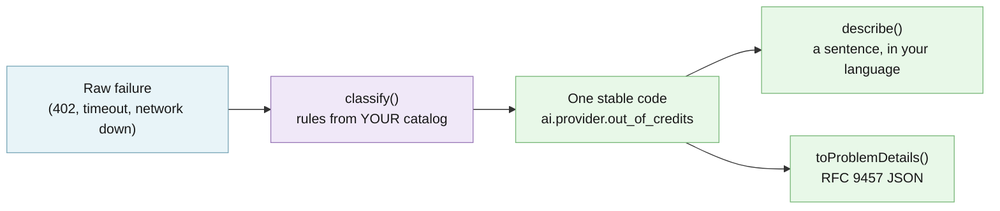

# @edgeproc/errors

Turns any error your app hits into one stable code and one clear message, for developers tired of mismatched error text.

[](https://github.com/hseshadr/errors/actions/workflows/ci.yml)
[](CHANGELOG.md)
[](LICENSE)

[Docs](#usage--api) · [Quickstart](#try-it-in-60-seconds)

```text
input:  errors.classify({ status: 402 })
output: ai.provider.out_of_credits
        "Your provider account is out of credits. Add credits and try again."
        { "type": "ai.provider.out_of_credits",
          "title": "Your provider account is out of credits. Add credits and try again.",
          "status": 402 }
```
<sub>Real output of the example below.</sub>

## At a glance

- **What it does** — Like a phrasebook for failures. Whatever went wrong (a web request came back "402 Payment Required", a download timed out, the network dropped), it gives the failure one fixed name such as `ai.provider.out_of_credits`, one sentence a person can read, and the same answer in a standard error format your server can send.
- **Who it's for** — A JavaScript or TypeScript developer whose app shows the same problem three different ways — "out of credits" on one screen, "check your settings" on another — because every error handler writes its own message.
- **What stays on your device / what leaves it** — Nothing leaves. The library makes no network calls and reads no files or settings: it only looks at the values you pass in and returns text and plain objects. It has no dependencies of its own.
- **Runs on** — Node.js 22.13 or newer (CI tests on Node 24). It is plain JavaScript with no Node-only imports, so a bundler can ship it to the browser too; CI does not run a browser test.
- **Not for** — Logging, retrying, or reporting errors: your app keeps those decisions. It also cannot guess a cause specific to your business unless you add a rule for it.
- **Status** — Beta (pre-1.0): v0.1.2 is the latest tagged release and the version on npm. See [CHANGELOG](CHANGELOG.md).

## Try it in 60 seconds

```bash
mkdir try-errors && cd try-errors && npm init -y >/dev/null && npm i @edgeproc/errors
```

Save this as `try.mjs` and run `node try.mjs` (the same file is
[`examples/out-of-credits.mjs`](examples/out-of-credits.mjs)):

```js
import { aiPack, corePack, defineErrorsWith } from "@edgeproc/errors";

// Your app's error list: 10 everyday codes + 9 for calling an AI service.
const errors = defineErrorsWith({}, corePack, aiPack);

// A raw failure, e.g. what fetch() returned: "402 Payment Required".
const code = errors.classify({ status: 402 });

console.log(code);
console.log(errors.describe(code));
console.log(JSON.stringify(errors.toProblemDetails(code), null, 2));
```

```text
ai.provider.out_of_credits
Your provider account is out of credits. Add credits and try again.
{
  "type": "ai.provider.out_of_credits",
  "title": "Your provider account is out of credits. Add credits and try again.",
  "status": 402
}
```

Line 1 is the fixed name for this failure, line 2 is the sentence to show a
person (swap in your own translations — see [Usage & API](#usage--api)), and the
JSON is the same error in the standard web-API error format (RFC 9457 "Problem
Details") that a server can send as-is.

More runnable examples: [`examples/`](examples/) — `pnpm demo` in a clone runs
[`examples/quickstart.mjs`](examples/quickstart.mjs), which adds your own codes and
a Spanish translation.

<!-- ======================== BELOW THE FOLD ======================== -->

## How it works

You register one catalog: the codes your app can report, each with a category,
a default English sentence, and optional rules (an HTTP status, a status range,
or a predicate). When something fails, `classify` looks at the raw value — its
`.status`, `.name`, and message text — and runs only the rules your catalog
declared, returning one code. `describe` turns that code into a sentence through
your own translation function, and `toProblemDetails` turns it into the RFC 9457
JSON shape. Nothing is global: a mapping exists only if a code in your catalog
declared it.



**[Explore the interactive architecture map →](docs/architecture/index.html)**
(Archify, generated from [`docs/architecture/runtime.architecture.json`](docs/architecture/runtime.architecture.json)).
Deep dive: [How `classify` picks a code](#how-classify-picks-a-code) and
[Under the hood](#under-the-hood-for-the-expert-reader).

It is thin glue over two mature standards, not a new framework:

- **[i18next](https://www.i18next.com/)** owns the human descriptions. You hand
  `describe()` your own `t` function. This package never imports i18next, so
  i18next is not a dependency of any kind — anything shaped like
  `t(key, params)` works, including a five-line stand-in.
- **[RFC 9457 Problem Details](https://www.rfc-editor.org/rfc/rfc9457)** owns the
  wire shape.

## What you can do

- Start from a ready-made list of codes, or declare every code yourself — [Which pack should you start from?](#which-pack-should-you-start-from)
- Turn any raw failure into one code — [What `classify` knows out of the box](#what-classify-knows-out-of-the-box)
- Show that code as a sentence in the user's language — [Classify a raw failure at the boundary](#classify-a-raw-failure-at-the-boundary)
- Send the same error from an API in the standard format — [Serialize it for an API (RFC 9457)](#serialize-it-for-an-api-rfc-9457)
- Throw a coded error when you already know the cause — [Throw a coded error](#throw-a-coded-error-when-you-already-know-the-cause)
- Pick what unknown failures fall back to — [Choose your own fallback code](#choose-your-own-fallback-code)
- Add your own categories (`auth`, `billing`, …) — [Categories are open](#categories-are-open)

## Why this and not X

The same HTTP `402` becomes _"out of credits"_ in Settings and a misleading
_"check your model and endpoint"_ in chat, because each `catch` block
re-invents the message. This collapses that N-way drift to one answer.

| Option | Where it is the better choice | What you give up |
| --- | --- | --- |
| **Do nothing** — each `catch` writes its own message | A tiny app with one or two error screens | Consistency: the same failure reads differently in different places, and nothing is greppable |
| **A hand-rolled `switch (status)` helper** | You only ever map HTTP statuses, in one language | Translations, a typed params contract, duplicate-code detection, and a wire format |
| **An error-reporting service** (Sentry and similar) | You need collection, alerting, and dashboards — this library does none of that | Nothing — they solve a different problem and pair well: log the stable code this produces |
| **`@edgeproc/errors`** | One vocabulary of codes shared by UI, logs, and API responses | You maintain a catalog; it does not log, retry, or report |

## Security and trust model

- **Verified:** nothing is downloaded or signed — the library does no I/O at all
  (no network, no filesystem, no environment access). It only matches the values
  you pass in against the catalog you registered.
- **Refuses rather than warns:** registering the same code twice across
  fragments throws `DuplicateCodeError`; a configured fallback code missing from
  your catalog throws `UnregisteredFallbackError` at startup rather than
  returning a code your registry cannot describe. `toProblemDetails` drops
  hostile params (`toJSON`, `__proto__`, `constructor`, `prototype`, the five
  RFC 9457 core member names) and any value that is not a string or a finite
  number, instead of putting them on the wire.
- **Not protected:** descriptions are interpolated, not escaped — escape them at
  the render site if you put them in HTML. Params you pass become public members
  of the Problem Details body, so never put a secret in a param.
- **Verify a release:** every npm release is published from CI with npm
  provenance (a signed statement of which commit and workflow built it — see
  [`publish.yml`](.github/workflows/publish.yml)). In a project that installed
  it, run `npm audit signatures`; the package page on npmjs.com also links the
  exact source commit.

See [SECURITY.md](SECURITY.md) for the full threat model and for reporting a
vulnerability.

## What this proves / what it does not prove

| Claim | Backed by |
| --- | --- |
| Every line and branch of the library is exercised | `pnpm test` — coverage thresholds pinned at 100% statements / branches / functions / lines in [`vitest.config.ts`](vitest.config.ts) |
| The hero output above is real | `pnpm build && node examples/out-of-credits.mjs` in this repo prints it byte-for-byte; so does the same file against the npm-published package |
| `starterPack` stays byte-identical for the repos that vendor it | [`test/vendored-consumer-compat.test.ts`](test/vendored-consumer-compat.test.ts), [`test/starter-pack.test.ts`](test/starter-pack.test.ts) |
| Hostile params and a polluted `Object.prototype` cannot shape the output | [`test/prototype-pollution.test.ts`](test/prototype-pollution.test.ts), [`test/prototype-keys.test.ts`](test/prototype-keys.test.ts), [`test/problem-details.test.ts`](test/problem-details.test.ts) |
| CI actions are pinned to full commit SHAs | [`test/workflow-security.test.ts`](test/workflow-security.test.ts) |
| This README's first screen keeps its shape | [`test/readme.contract.test.ts`](test/readme.contract.test.ts) |

It does **not** prove: that your own catalog's `match` predicates are correct,
that your translations are complete (a missing key falls back to the catalog's
English), or that the package behaves in a particular browser — CI runs on
Node only.

## Install

```bash
pnpm add @edgeproc/errors    # or: npm i @edgeproc/errors
```

Needs Node >= 22.13. Nothing to configure. Zero dependencies: no runtime deps,
no peer deps.

From source:

```bash
git clone https://github.com/hseshadr/errors.git && cd errors
pnpm install && pnpm build        # emits dist/
```

## Usage & API

Shipped today: a zero-runtime-dependency catalog, classifier, description helper, and
RFC 9457 serializer. It does not log, retry, or report errors for you; your application
owns those policies and supplies its own translation function. It also cannot infer a
business-specific cause unless your catalog declares the matching rule.

The smallest loop, from `corePack` alone:

```ts
import { corePack, defineErrorsWith } from "@edgeproc/errors";

const errors = defineErrorsWith({}, { ...corePack });

// A raw failure from anywhere — fetch, an SDK, a thrown DOMException.
const code = errors.classify({ status: 429, message: "Slow down" });

console.log(code);
// "http.rate_limited"

console.log(errors.describe(code));
// "Too many requests. Wait a moment and try again."
```

Want the full loop — register, classify, render in two languages, serialize to
RFC 9457? Clone this repo and run the demo:

```bash
pnpm install && pnpm demo   # builds, then runs examples/quickstart.mjs
```

### Which pack should you start from?

The package ships four catalogs. They are optional starting points, not a
mandate — you can also declare every code yourself and import none of them.

| Pack          | Codes | Take it when                                                                 |
| ------------- | ----- | ---------------------------------------------------------------------------- |
| `corePack`    | 10    | **Almost always. Start here.** Domain-neutral `http.*` / `net.*` / `request.*` / `config.*` / `internal.unknown`. |
| `aiPack`      | 9     | Your app calls an LLM provider. Adds `ai.*` — no key, rejected key, out of credits, rate limited, model unavailable. |
| `bundlePack`  | 5     | Your app downloads and verifies an artefact on the device (a WASM engine, a model, a screening list). Adds `bundle.*`. |
| `starterPack` | 18    | You are one of the repos already vendoring this library. New code should not reach for it — see below. |

Compose the halves you actually need:

```ts
import { aiPack, corePack, defineErrorsWith } from "@edgeproc/errors";

// Separate fragments, so a duplicate code across them throws at startup.
export const errors = defineErrorsWith({}, corePack, aiPack);
```

**`starterPack` is unchanged and still exported.** Same 18 codes, same English
byte-for-byte, same rule order — three product repos vendor a byte-identical
copy of this library and build their catalogs out of it, so it is frozen on
purpose. It is also, honestly, an AI/WASM catalog wearing a generic name: 14 of
its 18 codes are `ai.*` or `bundle.*`, three of them name another app's
"Settings → AI" screen in the English, and `ai.privacy.violation` carries a
`match` rule that string-matches `"PrivacyViolationError"` — a hard coupling to
`@edgeproc/privacy-core`. Starting a new shop from `starterPack` inherits an AI
provider catalog you never asked for. Use `corePack`.

### Register your errors

```ts
import { corePack, defineErrorsWith } from "@edgeproc/errors";

// Start from the 10 domain-neutral codes, add your own on top.
export const errors = defineErrorsWith(
  {},
  {
    ...corePack,
    "shop.out_of_stock": {
      category: "provider",
      params: ["sku"], // the typed contract for this code's params
      en: "Sorry, {sku} is sold out.",
    },
  },
);
```

### Classify a raw failure at the boundary

```ts
try {
  await callApi();
} catch (err) {
  const code = errors.classify(err); // e.g. { status: 429 } -> "http.rate_limited"
  showError(errors.describe(code, {}, t)); // render via YOUR i18next `t`
}
```

`describe` calls your app's i18next `t("errors.<code>", params)`. If that key
isn't localized yet, it falls back to the catalog's default English — so you're
never stuck with a raw key on screen.

### Serialize it for an API (RFC 9457)

```ts
// A Python/Node backend can emit the identical shape:
errors.toProblemDetails("http.rate_limited", { retryAfter: 30 });
// => { type: "http.rate_limited",
//      title: "Too many requests. Wait a moment and try again.",
//      status: 429, retryAfter: 30 }
```

`status` comes from the entry's first registered `httpStatus`; pass
`{ status }` in the third argument to override it.

Every other param becomes a **public extension member** on the wire, so never
pass anything you would not show the client. The RFC 9457 core members are
reserved: a param named `type`, `title`, `status`, `detail`, or `instance` is
dropped from the body (it can still fill a `{placeholder}` in the title). `type`
and `title` always come from the catalog, `status` and `instance` only from the
third argument, and `detail` is never emitted.

Params often arrive straight from `JSON.parse`, so the body is also guarded:

- A param named `toJSON`, `__proto__`, `constructor`, or `prototype` is never
  emitted — a `toJSON` param would otherwise replace the whole serialized body.
- Only a string or a **finite** number (the declared `ParamValue`) reaches the
  wire. Objects, arrays, booleans, `null`, `NaN`/`Infinity`, bigints, and
  functions are dropped.
- Only own, enumerable, string-keyed params are read. Catalog entries and the
  third-argument options are read as own properties too, so a polluted
  `Object.prototype` elsewhere in the process cannot inject a status, title,
  `type`, or match rule.

Dropped params still reach `describe` for title interpolation.

### Throw a coded error when you already know the cause

```ts
import { CanonicalError } from "@edgeproc/errors";

// At a throw-site, where no classification is needed — you know what happened:
throw errors.create("config.missing", { field: "STRIPE_KEY" });
// or standalone: new CanonicalError("config.missing", "config", { field: "..." })
```

### What `classify` knows out of the box

`classify` duck-types the raw failure (`.status`, `.name`, `.message`/`.body`)
and runs the rules **registered by the packs you actually composed**. Nothing is
global — a mapping only exists if a code in your catalog declared it.

**`corePack`:**

| Raw failure                      | Code                |
| -------------------------------- | ------------------- |
| `status: 401` / `403`            | `http.unauthorized` |
| `status: 404`                    | `http.not_found`    |
| `status: 429`                    | `http.rate_limited` |
| any `status` in `500–599`        | `http.server_error` |
| `name: "AbortError"` / timed out | `request.timeout`   |
| `"Failed to fetch"` (no status)  | `net.unreachable`   |
| _(anything else)_                | the fallback code   |

**`aiPack`** (compose on top of `corePack`; the code that registers a status
first wins, so `corePack`'s `http.*` keeps the shared statuses when you spread
`corePack` first):

| Raw failure               | Code                         |
| ------------------------- | ---------------------------- |
| `status: 402`             | `ai.provider.out_of_credits` |
| `status: 401` / `403`     | `ai.provider.unauthorized`   |
| `status: 404`             | `ai.model.unavailable`       |
| `status: 429`             | `ai.provider.rate_limited`   |
| any `status` in `500–599` | `ai.provider.server_error`   |
| timed out / aborted       | `ai.request.timeout`         |

`aiPack`'s `ai.privacy.violation` ships **no** `match` rule — the old one
string-matched the error name `"PrivacyViolationError"`, which coupled the
catalog to one specific egress guard. Attach your own predicate for whatever
yours throws.

**`bundlePack`** registers no statuses and no predicates at all. Its five codes
are for throw-sites you reach deliberately (`errors.create("bundle.quota_exceeded",
{ requiredBytes })`), not for classifying an unknown failure.

**`starterPack`** keeps its original table: `401`/`403` →
`ai.provider.unauthorized`, `402` → `ai.provider.out_of_credits`, `404` →
`ai.model.unavailable`, `429` → `ai.provider.rate_limited`, `AbortError` →
`ai.request.timeout`, `"Failed to fetch"` → `net.unreachable`,
`PrivacyViolationError` → `ai.privacy.violation`.

Its 5xx mapping is **exactly four statuses** — `500`, `502`, `503`, `504`. A
`501`, `507`, `522` or `599` falls through to the fallback. That is deliberate,
frozen, and asserted by a test, because the vendored consumers ship that
behaviour today. `corePack.http.server_error` and `aiPack.ai.provider.server_error`
both claim the **whole** `[500, 599]` range instead, via `httpStatusRange`.

Your catalog extends whichever pack you took: any entry's `httpStatus`,
`httpStatusRange` or `match` predicate joins the same rule engine.

### How `classify` picks a code

Four tiers, in this order. The first one that produces a code wins.

1. **`match` predicates** — highest `priority` first, registration order within a
   tie.
2. **The exact `httpStatus` table** — the first code registered for a status
   keeps it, so a code cannot be silently stolen by a later fragment.
3. **`httpStatusRange`** — an inclusive `[min, max]`, in registration order.
   Consulted only after the exact table, so a code that names `500` still beats a
   range that merely covers it.
4. **The fallback code** — `internal.unknown` unless you configured another.

#### `priority`: the escape hatch from the spread trap

`match` predicates are ordinary functions, and a broad one is greedy.
`{ ...somePack, ...ownCodes }` puts the pack's rules **first**, so a broad
`/timeout|timed out/i` rule claims `"db timeout after 30s"` before your own
`db.query.timeout` rule ever runs.

`priority` fixes the order without reordering the object. It defaults to `0`,
which is plain registration order; higher runs earlier, and negative runs last.

```ts
const errors = defineErrorsWith(
  {},
  {
    ...corePack,
    "db.query.timeout": {
      category: "timeout",
      priority: 10, // beats any default-priority rule, wherever it was registered
      match: (raw) => /db .*timeout/i.test(String((raw as Error)?.message ?? "")),
      en: "The database query timed out.",
    },
  },
);
```

`corePack` marks its own two text-sniffing rules (`request.timeout`,
`net.unreachable`) `priority: -10`, so they run behind every default-priority
rule — including yours. You get the safety net without the theft.

### Choose your own fallback code

`defineErrorsWith(options, ...fragments)` is `defineErrors` with registry-wide
settings in front. Today there is one: `fallbackCode`, the code `classify`
returns when nothing else claims the raw failure.

```ts
import { defineErrorsWith } from "@edgeproc/errors";

export const errors = defineErrorsWith(
  { fallbackCode: "shop.unknown" },
  shopCodes,
);

errors.classify({ weird: true }); // "shop.unknown", not "internal.unknown"
```

**Why this exists.** The fallback used to be hardcoded to `internal.unknown`. A
consumer with their own catalog that never declared that code still got it back
from `classify` — a code their registry did not contain. `has()` said false,
`get()` returned `undefined`, `describe()` echoed the bare key instead of a
sentence, and `toProblemDetails()` put that bare key on the wire as both `type`
and `title`. The one error a user sees when everything else has already gone
wrong was the one error the system could not describe.

`defineErrorsWith` therefore **validates** the fallback: it must be a code the
merged catalog registers, or it throws `UnregisteredFallbackError` at
registration, naming the offending code. Opting into options is opting into the
check. `DEFAULT_FALLBACK_CODE` is exported if you want to name the default
explicitly.

`defineErrors` keeps its old, lenient behaviour unchanged: fallback
`internal.unknown`, no validation. Nothing that already calls it has to move.

### Categories are open

`category` is how UI and telemetry decide the treatment — retry, or "open
Settings", or "free up space". This library ships seven, exported as
`KnownCategory`:

`provider` · `config` · `network` · `timeout` · `device` · `integrity` ·
`internal`

`Category` is `KnownCategory | (string & Record<never, never>)`, which is the
TypeScript idiom for "open union with suggestions". The seven still autocomplete
in an editor, and `auth`, `validation` or `billing` type-check without you
patching or forking this library.

```ts
const errors = defineErrorsWith(
  {},
  {
    ...corePack,
    "auth.session_expired": {
      category: "auth", // not one of the seven — still valid
      en: "Your session expired. Sign in again.",
    },
  },
);
```

### API reference

| Export                                         | Kind  | Role                                                                   |
| ---------------------------------------------- | ----- | ---------------------------------------------------------------------- |
| `defineErrors`                                 | fn    | register one/more catalog fragments → a typed `Registry`               |
| `defineErrorsWith`                             | fn    | `defineErrors` + `RegistryOptions` (today: a validated `fallbackCode`)  |
| `DEFAULT_FALLBACK_CODE`                        | const | `"internal.unknown"` — the fallback when you configure none            |
| `UnregisteredFallbackError`                    | class | thrown when the configured `fallbackCode` is not in the catalog        |
| `corePack`                                     | const | 10 domain-neutral codes — **the pack to start from**                   |
| `aiPack`                                       | const | 9 `ai.*` codes, for apps that call an LLM provider                     |
| `bundlePack`                                   | const | 5 `bundle.*` codes, for apps that download an artefact                 |
| `starterPack`                                  | const | the original 18 codes, frozen for the repos that vendor them           |
| `CanonicalError`                               | class | `Error` subclass carrying `{ code, params, category }`                 |
| `DuplicateCodeError`                           | class | thrown when a code is defined in two fragments                         |
| `errorNameOf` / `errorTextOf` / `httpStatusOf` | fn    | duck-type helpers for writing your own `match` rules                   |

`Registry` methods: `classify(raw)`, `describe(code, params?, t?)`,
`toProblemDetails(code, params?, opts?)`, `create(code, params?)`, plus
`codes` / `has` / `get`. Every lookup is own-property only: an unregistered
name such as `"constructor"` or `"__proto__"` is simply unregistered, never an
inherited `Object.prototype` member.

`CatalogEntry` fields: `category` (required), `en`, `params`, `i18nKey`,
`httpStatus`, `httpStatusRange`, `problemType`, `match`, `priority`.

Types: `Catalog`, `CatalogEntry`, `Category`, `KnownCategory`, `ErrorCode`,
`MatchRule`, `Params`, `ParamsFor`, `ParamValue`, `ProblemDetails`,
`ProblemOptions`, `Registry`, `RegistryOptions`, `TFunction`.

### Under the hood (for the expert reader)

- **The code is the identity.** `<domain>.<subject>.<reason>`, greppable and
  loggable. A shipped code is a stable API contract — deprecate, never rename.
- **The catalog entry is the typed params contract.** `params: ["retryAfter"]`
  is what makes `describe(code, { retryAfter })` type-check; there's no reliance
  on i18next's own type inference, keeping coupling low.
- **Two ways to register.** A single spread object
  (`defineErrorsWith({}, { ...corePack, ...own })`) gives the richest param
  typing; separate fragments (`defineErrorsWith({}, corePack, own)`) add runtime
  duplicate-code detection across them.
- **Classify precedence.** `match` predicates (by `priority`, then registration
  order), then the exact `httpStatus` table (first registration wins — codes stay
  stable), then `httpStatusRange`, then the fallback code.
- **RFC 9457 caveat.** Problem Details is literally "for HTTP APIs"; on the
  client we adopt its _shape_ as a clean envelope. The real payoff is a backend
  emitting it verbatim.

A full runnable walkthrough — register, classify, translate, serialize — lives in
[`examples/quickstart.mjs`](examples/quickstart.mjs).

## Configuration

There are no environment variables and no config files. The only registry-wide
setting is `RegistryOptions.fallbackCode` (default `"internal.unknown"`), passed
as the first argument to `defineErrorsWith` — see
[Choose your own fallback code](#choose-your-own-fallback-code). Everything else
is your catalog.

## Limitations & roadmap

**Shipped:** the catalog, `classify`, `describe`, `toProblemDetails`, `create`,
`CanonicalError`, and the four packs (`corePack`, `aiPack`, `bundlePack`,
`starterPack`) — in tagged release v0.1.2, published to npm (see
[CHANGELOG](CHANGELOG.md)).

**Limitations:** it does not log, retry, or report errors; it does not escape
descriptions for HTML; it cannot infer a business-specific cause without a rule
in your catalog. There is no hosted service or hidden global registry.

**Planned (not shipped):** nothing is announced. No roadmap feature is implied by
the interfaces in this package; future behavior belongs in the changelog before
it is documented as available.

## Getting help

- **GitHub Issues** — Best for: bugs and concrete feature requests. Include the version, what you passed in, what you got back, and what you expected.
- **Email (private)** — Best for: security reports; see [SECURITY.md](SECURITY.md). Never open a public issue for a vulnerability.

## Contributing / development

```bash
pnpm gate   # lint (biome) + typecheck (tsc) + test (vitest) + build
```

`pnpm gate` is the exact command CI runs. Coverage is enforced at 100% of
statements, branches, functions and lines — see
[`vitest.config.ts`](vitest.config.ts).

Installs use a 24-hour quarantine for new package releases and a native-build
allowlist limited to Biome and esbuild. CI, the weekly audit, and publishing all
use those same pnpm controls; no workflow can bypass them.

See [CONTRIBUTING.md](CONTRIBUTING.md).

## License / Citation

MIT — see [LICENSE](LICENSE).
