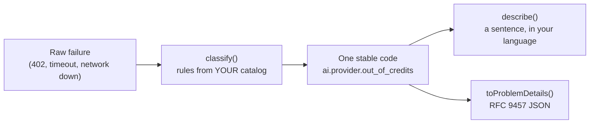

# Architecture

How `@edgeproc/errors` turns a raw failure into one code, why it is built that
way, and what the tests prove. For usage examples, see the [API guide](API.md).

## The short version

You register one catalog: the codes your app can report, each with a category,
a default English sentence, and optional rules (an exact HTTP status, a status
range, or a `match` function). When something fails, `classify` looks at the
raw value (its `.status`, `.name`, and message text) and runs only the rules
your catalog declared, returning one code. `describe` turns that code into a
sentence through your own translation function, and `toProblemDetails` turns it
into the RFC 9457 JSON shape. Nothing is global: a mapping exists only if a code
in your catalog declared it.

An interactive version of this diagram lives at
[`architecture/index.html`](architecture/index.html) (generated by Archify from
[`architecture/runtime.architecture.json`](architecture/runtime.architecture.json)).

It is thin glue over two existing standards, not a new framework:

- **[i18next](https://www.i18next.com/)** owns the human descriptions. You hand
  `describe()` your own `t` function. This package never imports i18next, so
  i18next is not a dependency of any kind. Anything shaped like
  `t(key, params)` works, including a five-line stand-in.
- **[RFC 9457 Problem Details](https://www.rfc-editor.org/rfc/rfc9457)** owns
  the wire shape.

## Source files

| File | What it does |
| --- | --- |
| `src/registry.ts` | `defineErrors` / `defineErrorsWith`: merges catalog fragments, builds the rule tables, and returns the `Registry` (`classify`, `describe`, `toProblemDetails`, `create`, `codes`, `has`, `get`). |
| `src/starter-pack.ts` | The four ready-made catalogs: `corePack`, `aiPack`, `bundlePack`, `starterPack`. |
| `src/raw.ts` | Duck-typing helpers that read `.status`, `.name`, and message text from any thrown value. |
| `src/canonical-error.ts` | `CanonicalError`, an `Error` subclass carrying `{ code, params, category }`. |
| `src/types.ts` | All public types (`Catalog`, `CatalogEntry`, `Category`, `ProblemDetails`, ...). |
| `src/index.ts` | The public export list. |

## Design choices

- **The code is the identity.** `<domain>.<subject>.<reason>`, easy to search
  for and safe to log. A shipped code is a stable API contract: deprecate it,
  never rename it.
- **The catalog entry is the typed params contract.** `params: ["retryAfter"]`
  is what makes `describe(code, { retryAfter })` type-check. It does not rely on
  i18next's own type inference, which keeps the coupling low.
- **Two ways to register.** A single spread object
  (`defineErrorsWith({}, { ...corePack, ...own })`) gives the richest param
  typing. Separate fragments (`defineErrorsWith({}, corePack, own)`) add a
  runtime check that no code is defined twice.
- **RFC 9457 on the client.** Problem Details is written "for HTTP APIs". On the
  client this package uses its shape as a clean envelope. The real payoff is a
  backend sending the same shape as-is.

## How `classify` picks a code

`classify` duck-types the raw failure (`.status`, `.name`, `.message` or
`.body`) and runs the rules registered by the packs you actually composed. Four
tiers, in this order. The first one that produces a code wins.

1. **`match` predicates**, highest `priority` first, registration order within
   a tie.
2. **The exact `httpStatus` table.** The first code registered for a status
   keeps it, so a later fragment cannot silently steal it.
3. **`httpStatusRange`**, an inclusive `[min, max]`, in registration order.
   Consulted only after the exact table, so a code that names `500` still beats
   a range that merely covers it.
4. **The fallback code**: `internal.unknown` unless you configured another.

### `priority`: getting out of the spread-order trap

`match` predicates are ordinary functions, and a broad one is greedy.
`{ ...somePack, ...ownCodes }` puts the pack's rules first, so a broad
`/timeout|timed out/i` rule claims `"db timeout after 30s"` before your own
`db.query.timeout` rule ever runs.

`priority` fixes the order without reordering the object. It defaults to `0`,
which is plain registration order. Higher runs earlier, and negative runs last.
`corePack` marks its own two text-sniffing rules (`request.timeout`,
`net.unreachable`) `priority: -10`, so they run behind every default-priority
rule, including yours. See the [API guide](API.md#rule-order-and-priority) for
an example.

## What each pack classifies

**`corePack`** (10 codes: `http.unauthorized`, `http.not_found`,
`http.rate_limited`, `http.server_error`, `net.unreachable`, `request.timeout`,
`request.cancelled`, `config.missing`, `config.invalid`, `internal.unknown`):

| Raw failure                      | Code                |
| -------------------------------- | ------------------- |
| `status: 401` / `403`            | `http.unauthorized` |
| `status: 404`                    | `http.not_found`    |
| `status: 429`                    | `http.rate_limited` |
| any `status` in `500–599`        | `http.server_error` |
| `name: "AbortError"` / timed out | `request.timeout`   |
| `"Failed to fetch"` (no status)  | `net.unreachable`   |
| _(anything else)_                | the fallback code   |

**`aiPack`** (9 codes: `ai.config.no_key`, `ai.provider.unauthorized`,
`ai.provider.out_of_credits`, `ai.provider.rate_limited`,
`ai.provider.server_error`, `ai.model.unavailable`, `ai.request.timeout`,
`ai.request.cancelled`, `ai.privacy.violation`):

| Raw failure               | Code                         |
| ------------------------- | ---------------------------- |
| `status: 402`             | `ai.provider.out_of_credits` |
| `status: 401` / `403`     | `ai.provider.unauthorized`   |
| `status: 404`             | `ai.model.unavailable`       |
| `status: 429`             | `ai.provider.rate_limited`   |
| any `status` in `500–599` | `ai.provider.server_error`   |
| timed out / aborted       | `ai.request.timeout`         |

The code that registers a status first wins. With
`defineErrorsWith({}, corePack, aiPack)`, `corePack` keeps 401, 403, 404, 429,
the 5xx range, timeouts, and network drops, so `aiPack` only adds 402. With
`defineErrorsWith({}, aiPack, corePack)`, the AI codes win those statuses
instead. `aiPack` does not register `internal.unknown`, so on its own it needs
`corePack` alongside it or a `fallbackCode` of its own, or `defineErrorsWith`
throws `UnregisteredFallbackError`.

`aiPack`'s `ai.privacy.violation` ships no `match` rule. The old one
string-matched the error name `"PrivacyViolationError"`, which tied the catalog
to one specific egress guard. Attach your own predicate for whatever yours
throws.

**`bundlePack`** (5 `bundle.*` codes) registers no statuses and no predicates at
all. Its codes are for throw-sites you reach on purpose
(`errors.create("bundle.quota_exceeded", { requiredBytes })`), not for
classifying an unknown failure.

**`starterPack`** (18 codes) is unchanged and still exported. Same codes, same
English byte for byte, same rule order. Three product repos vendor a
byte-identical copy of this library and build their catalogs out of it, so it is
frozen on purpose. It is also an AI/WASM catalog with a generic name: 14 of its
18 codes are `ai.*` or `bundle.*`, three of them name another app's
"Settings → AI" screen in the English, and `ai.privacy.violation` carries a
`match` rule that string-matches `"PrivacyViolationError"`, which ties it to
`@edgeproc/privacy-core`. New code should use `corePack`.

Its table: `401`/`403` → `ai.provider.unauthorized`, `402` →
`ai.provider.out_of_credits`, `404` → `ai.model.unavailable`, `429` →
`ai.provider.rate_limited`, `AbortError` → `ai.request.timeout`,
`"Failed to fetch"` → `net.unreachable`, `PrivacyViolationError` →
`ai.privacy.violation`. Its 5xx mapping is exactly four statuses: `500`, `502`,
`503`, `504`. A `501`, `507`, `522` or `599` falls through to the fallback. That
is deliberate, frozen, and asserted by a test, because the vendored copies ship
that behaviour today. `corePack`'s `http.server_error` and `aiPack`'s
`ai.provider.server_error` both claim the whole `[500, 599]` range instead, via
`httpStatusRange`.

Your catalog extends whichever pack you took: any entry's `httpStatus`,
`httpStatusRange` or `match` predicate joins the same rule engine.

## The fallback code

The fallback used to be hardcoded to `internal.unknown`. A consumer with their
own catalog that never declared that code still got it back from `classify`, a
code their registry did not contain. `has()` said false, `get()` returned
`undefined`, `describe()` echoed the bare key instead of a sentence, and
`toProblemDetails()` put that bare key on the wire as both `type` and `title`.
The one error a user sees when everything else has already gone wrong was the
one error the system could not describe.

`defineErrorsWith` therefore validates the fallback: it must be a code the
merged catalog registers, or it throws `UnregisteredFallbackError` at
registration, naming the offending code. Opting into options is opting into the
check. `defineErrors` keeps its old, lenient behaviour: fallback
`internal.unknown`, no validation.

## The JSON body's safety rules

`toProblemDetails(code, params, opts)` builds the RFC 9457 body.

- `status` comes from the entry's first registered `httpStatus`. Pass
  `{ status }` in the third argument to override it.
- Every other param becomes a public extension member on the wire, so never pass
  anything you would not show the client.
- The RFC 9457 core members are reserved. A param named `type`, `title`,
  `status`, `detail`, or `instance` is dropped from the body (it can still fill a
  `{placeholder}` in the title). `type` and `title` always come from the catalog,
  `status` and `instance` only from the third argument, and `detail` is never
  emitted.

Params often arrive straight from `JSON.parse`, so the body is also guarded:

- A param named `toJSON`, `__proto__`, `constructor`, or `prototype` is never
  emitted. A `toJSON` param would otherwise replace the whole serialized body.
- Only a string or a finite number (the declared `ParamValue`) reaches the
  wire. Objects, arrays, booleans, `null`, `NaN`/`Infinity`, bigints, and
  functions are dropped.
- Only own, enumerable, string-keyed params are read. Catalog entries and the
  third-argument options are read as own properties too, so a polluted
  `Object.prototype` elsewhere in the process cannot inject a status, title,
  `type`, or match rule.
- Every registry lookup is own-property only: an unregistered name such as
  `"constructor"` or `"__proto__"` is simply unregistered, never an inherited
  `Object.prototype` member.

Dropped params still reach `describe` for title interpolation.

## Security model

- **What it checks:** nothing is downloaded or signed. The library does no I/O
  at all (no network, no filesystem, no environment access). It only matches the
  values you pass in against the catalog you registered.
- **What it refuses:** registering the same code twice across fragments throws
  `DuplicateCodeError`. An `httpStatus` that is not a list of whole numbers
  (`408` instead of `[408]`) throws `InvalidCatalogEntryError`, naming the code. A configured fallback code missing from your catalog
  throws `UnregisteredFallbackError` at startup, rather than returning a code
  your registry cannot describe. `toProblemDetails` drops hostile params (see
  above) instead of putting them on the wire.
- **What it does not protect:** descriptions are interpolated, not escaped, so
  escape them at the render site if you put them in HTML. Params you pass become
  public members of the Problem Details body, so never put a secret in a param.
- **Checking a release:** every npm release is published from CI with npm
  provenance (a signed statement of which commit and workflow built it; see
  [`publish.yml`](../.github/workflows/publish.yml)). In a project that
  installed it, run `npm audit signatures`. The package page on npmjs.com also
  links the exact source commit.

See [SECURITY.md](../SECURITY.md) for the full threat model and for reporting a
vulnerability.

## What the tests prove

| Claim | Backed by |
| --- | --- |
| Every line and branch of the library is exercised | `pnpm test`, with coverage thresholds pinned at 100% statements / branches / functions / lines in [`vitest.config.ts`](../vitest.config.ts) |
| The README's example and its pasted output are real | [`test/readme.contract.test.ts`](../test/readme.contract.test.ts) runs [`examples/try.mjs`](../examples/try.mjs) against `src/` and compares the output to the README byte for byte |
| The README's pack table matches the packs | [`test/pack-code-sets.test.ts`](../test/pack-code-sets.test.ts) |
| `starterPack` stays byte-identical for the repos that vendor it | [`test/vendored-consumer-compat.test.ts`](../test/vendored-consumer-compat.test.ts), [`test/starter-pack.test.ts`](../test/starter-pack.test.ts) |
| Hostile params and a polluted `Object.prototype` cannot shape the output | [`test/prototype-pollution.test.ts`](../test/prototype-pollution.test.ts), [`test/prototype-keys.test.ts`](../test/prototype-keys.test.ts), [`test/problem-details.test.ts`](../test/problem-details.test.ts) |
| CI actions are pinned to full commit SHAs | [`test/workflow-security.test.ts`](../test/workflow-security.test.ts) |

The tests do not prove that your own catalog's `match` predicates are correct,
that your translations are complete (a missing key falls back to the catalog's
English), or that the package behaves in a particular browser. CI runs on Node
only.

## Status and roadmap

Shipped: the catalog, `classify`, `describe`, `toProblemDetails`, `create`,
`CanonicalError`, and the four packs, in v0.1.3 on npm (see the
[CHANGELOG](../CHANGELOG.md)).

Planned: nothing is announced. No roadmap feature is implied by the interfaces
in this package. Future behaviour goes into the changelog before it is
documented as available.
